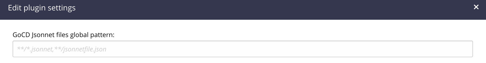

[](https://gitter.im/gocd/configrepo-plugins?utm_source=badge&utm_medium=badge&utm_campaign=pr-badge&utm_content=badge)

# gocd-jsonnet-config-plugin

[GoCD](https://www.gocd.org) plugin to keep **pipelines** and **environments**
configuration in source-control in [Jsonnet](https://jsonnet.org/).
See [this document](https://docs.gocd.org/current/advanced_usage/pipelines_as_code.html)
to find out what are GoCD configuration repositories.

This is the third GoCD configuration plugin, which builds off of the
[YAML configuration plugin](https://github.com/tomzo/gocd-yaml-config-plugin)

* Format is **extensible** - you can use libraries and functions to build your configuration
* Format is **concise** - you can use variables, functions, and imports to keep your configuration DRY
* Format is **powerful** - you can use conditionals, comprehensions, and other language features to build your configuration

# Table of contents

1. [Setup](#setup)
1. [File pattern](#file-pattern)
1. [Overview](#Overview)
1. [Development](#Development)

# Setup

**Step 1**: You need to install the plugin in the GoCD server. Download it from
[the releases page](https://github.com/getsentry/gocd-jsonnet-config-plugin/releases) and place it on the GoCD server in
`plugins/external` [directory](https://docs.gocd.org/current/extension_points/plugin_user_guide.html).


**Step 2**: Follow [the GoCD documentation](https://docs.gocd.org/current/advanced_usage/pipelines_as_code.html#storing-pipeline-configuration-in-json) to add a new configuration repository.

You can use the example repository at: `https://github.com/getsentry/gocd-jsonnet-config-example.git`.

## File pattern

The default pattern is `**/*.jsonnet,**/jsonnetfile.json`, which will recursively search the entire repository for all files ending with `.jsonnet` and files named `jsonnetfile.json`. While `jsonnetfile.json` is not a valid jsonnet file, it is used to specify dependencies for the jsonnet files. See [jsonnet-bundler](https://github.com/jsonnet-bundler/jsonnet-bundler) for more information. If there are no external dependencies, you can omit the `jsonnetfile.json` file.

You can set a custom file pattern per configuration repository using the GoCD configuration UI:


Or in the config XML using `<configuration>`:

```xml
<config-repos>
  <config-repo pluginId="jsonnet.config.plugin" id="repo1">
    <git url="https://github.com/getsentry/gocd-jsonnet-config-plugin.git" />
    <configuration>
      <property>
        <key>file_pattern</key>
        <!-- comma-separate multiple patterns -->
        <value>pipelines/build/*.jsonnet,pipelines/lint/*.jsonnet</value>
      </property>
    </configuration>
  </config-repo>
</config-repos>
```

# Overview

Please note this brief overview of what is done by the plugin:
 * parsing jsonnet into json when GoCD server asks for it.

And this is done by the GoCD server:
 * complex logic merging multiple config repo sources and XML
 * validation of pipelines/stages/jobs/tasks domain
 * any UI rendering

# Development

## Environment setup

To build and test this plugin, you'll need java jdk >= 11.

If you have local java environment, then you may run all tests and create a ready to use jar with:
```bash
./gradlew test jar
```

## Versioning

We use semantic versioning.
